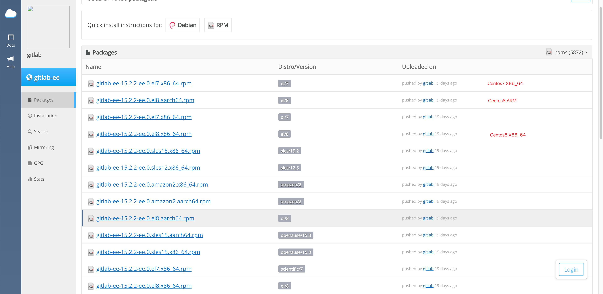
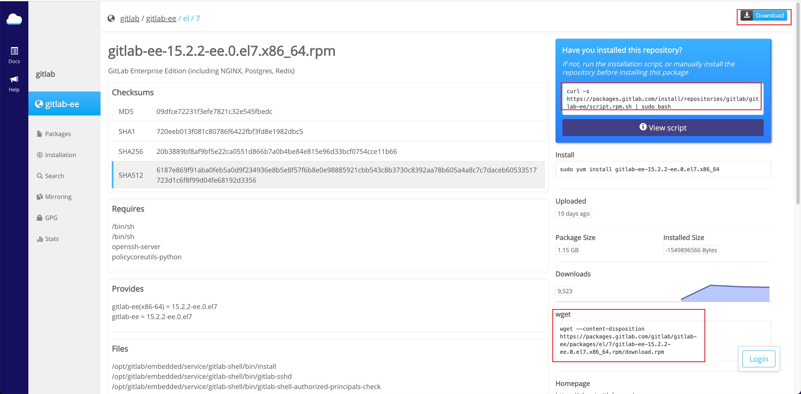
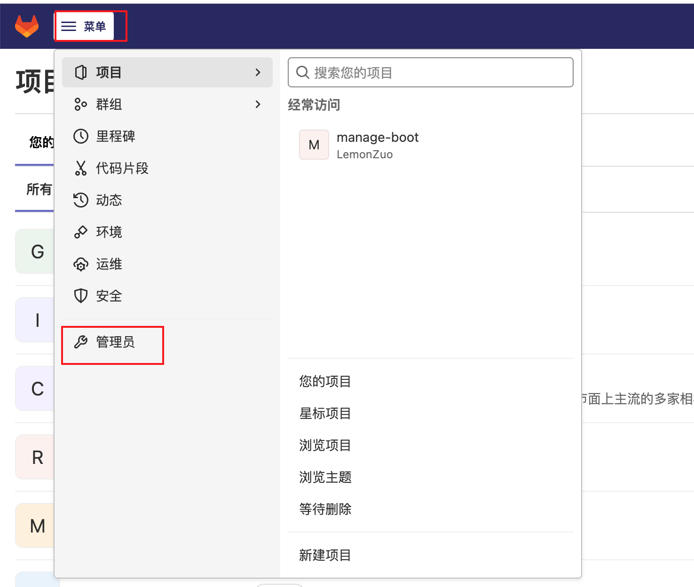
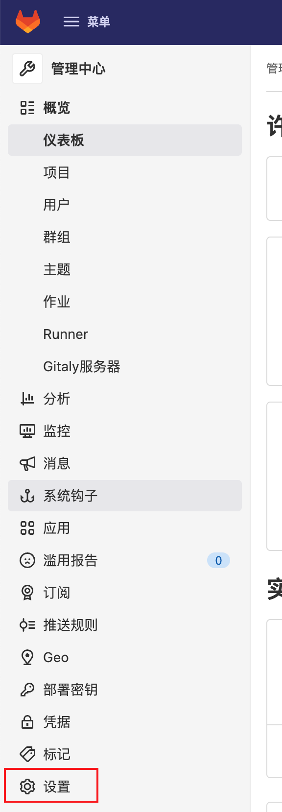
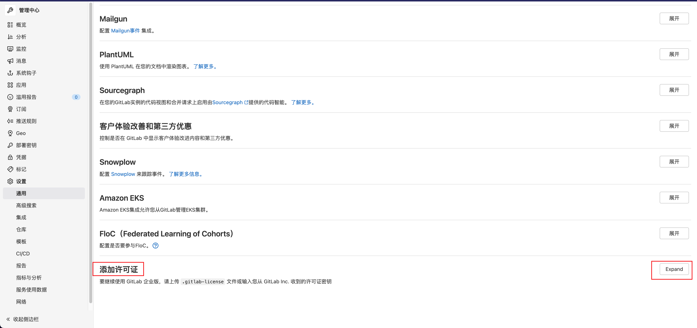
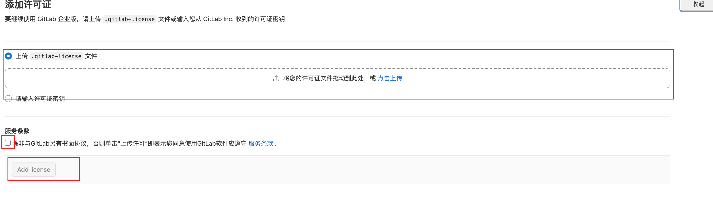
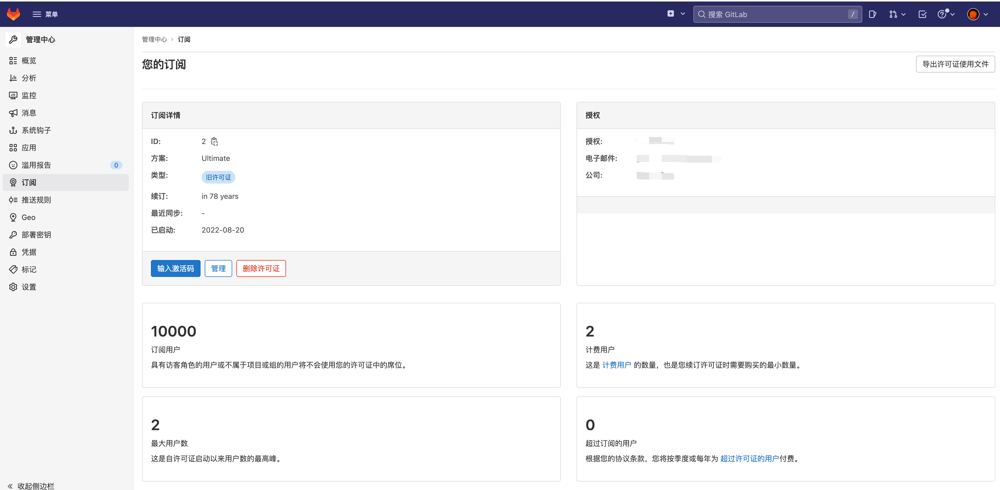

# GitLabEE 安装

> 参考博客: https://blog.csdn.net/wangpaiblog/article/details/122264366

## 下载安装包

> 下载地址: https://packages.gitlab.com/gitlab/gitlab-ee
>
> 需选择系统架构所对应的安装包





## 执行安装

~~~shell
yum localinstall gitlab-ee-15.2.2-ee.0.el7.x86_64.rpm
~~~

# GitLab配置

~~~shell
cd /etc/gitlab/
vim gitlab.rb
~~~

## 访问URL配置

```shell
external_url 'https://abc.com'
```

## 邮件配置

~~~shell
# 邮件配置(腾讯企业邮箱)
gitlab_rails['smtp_enable'] = true
gitlab_rails['smtp_address'] = "smtp.exmail.qq.com"
gitlab_rails['smtp_port'] = 465
gitlab_rails['smtp_user_name'] = "邮箱用户名"
gitlab_rails['smtp_password'] = "邮箱授权密码"
gitlab_rails['smtp_authentication'] = "login"
gitlab_rails['smtp_enable_starttls_auto'] = true
gitlab_rails['smtp_tls'] = true
gitlab_rails['gitlab_email_from'] = '邮箱用户名'
gitlab_rails['smtp_domain'] = "exmail.qq.com"
~~~

## 内部Nginx配置

```shell
# Nginx配置
# nginx监听端口
nginx['listen_port'] = 50000
# ssl证书配置
nginx['ssl_certificate'] = "/opt/module/nginx/cert/cert.pem"
nginx['ssl_certificate_key'] = "/opt/module/nginx/cert/key.pem"
```

## 数据目录配置

~~~shell
git_data_dirs({
  "default" => {
    "path" => "数据目录"
   }
})
~~~

## 内存优化配置

~~~shell
puma['worker_processes'] = 0

sidekiq['max_concurrency'] = 10

prometheus_monitoring['enable'] = false

gitlab_rails['env'] = {
  'MALLOC_CONF' => 'dirty_decay_ms:1000,muzzy_decay_ms:1000'
}

gitaly['configuration'] = {
  concurrency: [
    {
      'rpc' => "/gitaly.SmartHTTPService/PostReceivePack",
      'max_per_repo' => 3,
    }, {
      'rpc' => "/gitaly.SSHService/SSHUploadPack",
      'max_per_repo' => 3,
    },
  ],
  cgroups: {
    repositories: {
      count: 2,
    },
    mountpoint: '/sys/fs/cgroup',
    hierarchy_root: 'gitaly',
    memory_bytes: 500000,
    cpu_shares: 512,
  },
}
gitaly['env'] = {
  'MALLOC_CONF' => 'dirty_decay_ms:1000,muzzy_decay_ms:1000',
  'GITALY_COMMAND_SPAWN_MAX_PARALLEL' => '2'
}
~~~

## postgresql配置

```shell
# postgresql可供远程连接配置信息

# postgresql 配置
postgresql['listen_address'] = '0.0.0.0'
postgresql['port'] = 54320
# 免密码认证ip
postgresql['trust_auth_cidr_addresses'] = %w(127.0.0.1/24)
# 需密码认证ip
postgresql['md5_auth_cidr_addresses'] = %w(192.168.31.0/24)
postgresql['sql_user'] = "gitlab"
postgresql['sql_user_password'] = Digest::MD5.hexdigest "密码" << postgresql['sql_user']
# postgresql['hostssl'] = true
gitlab_rails['db_host'] = '127.0.0.1'
gitlab_rails['db_port'] = 54320
gitlab_rails['db_username'] = "gitlab"
# 如果通过 TCP/IP 连接到 PostgreSQL，并且从上面设置的 postgresql['md5_auth_cidr_addresses'] 块中的一个实例连接到 PostgreSQL，则必须提供。
# 如果您连接到 127.0.0.1 并且已经配置了 postgresql['trust_auth_cidr_addresses'] 以包含它，则这不是必需的
# gitlab_rails['db_password'] = "密码"
gitlab_rails['db_database'] = "gitlabhq_production"

```


> 使配置生效： gitlab-ctl reconfigure

## 生成license

> 项目地址: https://github.com/LemonZuo/license.git
>
> 生成license接口地址: 
>
> POST /license/generate
>
> 接口参数: form-data
>
> Name：名称
>
> Company：公司名
>
> Email：邮箱

接口会返回一个压缩包，压缩包内会包含公钥文件和license文件，

.license_encryption_key.pub直接替换 /opt/gitlab/embedded/service/gitlab-rails/.license_encryption_key.pub

license.gitlab-license：证书文件

# 上传license

> 启动gitlab
>
> gitlab-ctl restart
>
> 管理员账户登录后上传文件
>
> 
>
> 
>
> 
>
> 
>
> 