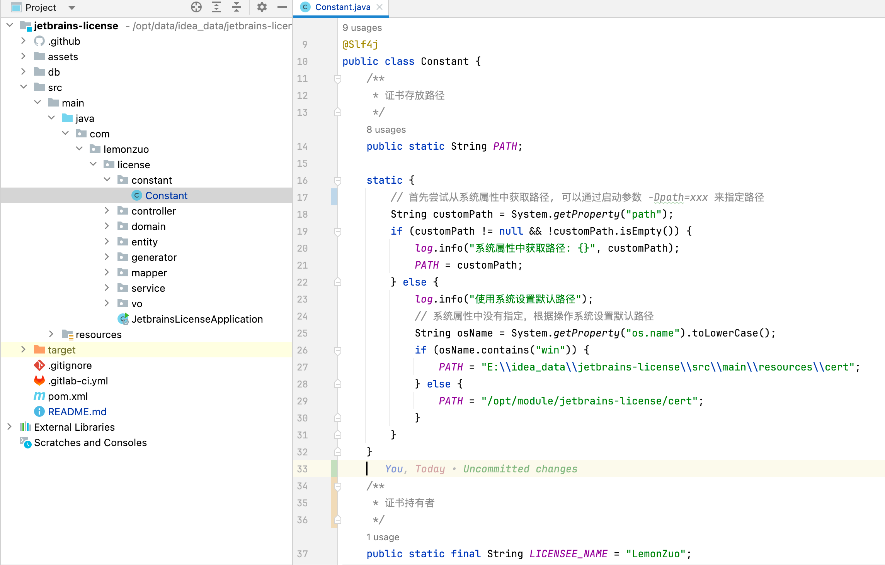
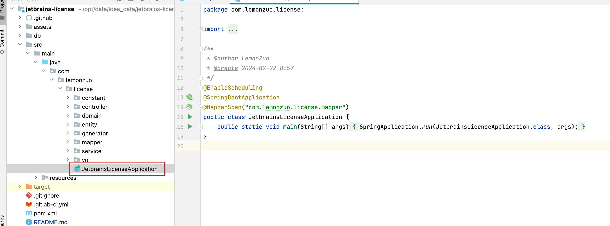
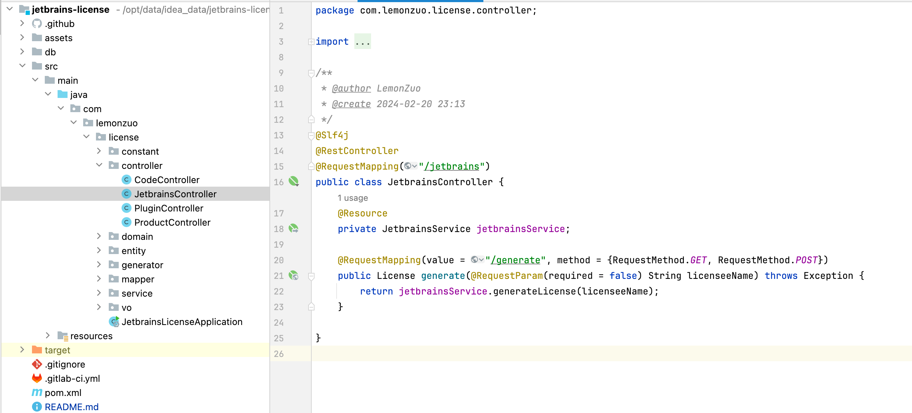
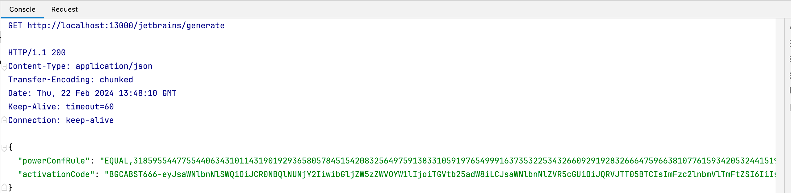
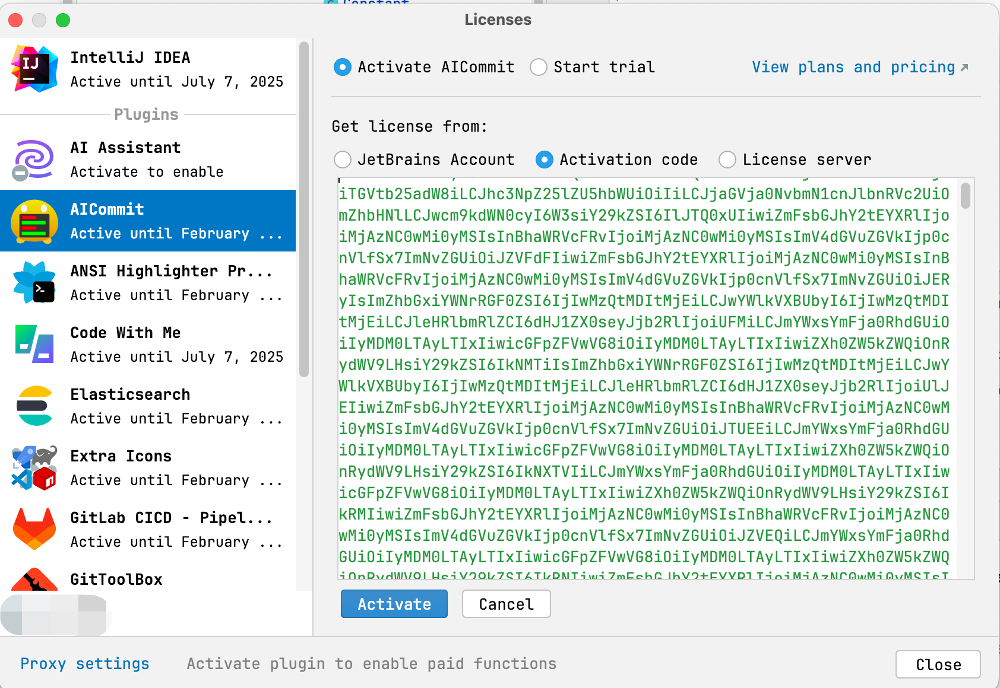

# 使用方法

1. JDK版本 >= 17

1. 修改部分常量

   

1. 启动主程序

   

1. 生成入口

   

1. 获取生成的数据

   

1. 使用生成的activationCode

   

# 参考链接

> https://linux.do/t/topic/9132/34

# 免责声明

## 项目目的

本项目被开发和分享仅用于教育目的，旨在提供技术研究和学术学习的机会。项目内容涉及的技术和方法仅供学习和研究使用。

## 使用限制

项目作者发布此项目的目的不是鼓励软件盗版或任何形式的非法活动，而是为了促进知识的共享和技术的进步。**严禁将本项目用于破解、激活或以任何方式非法使用软件**。用户在使用本项目时，必须遵守所有适用的当地和国际法律法规。

## 商业用途禁止

本项目**严禁用于商业用途**或任何形式的盈利活动。项目的任何部分都不得在任何可能直接或间接产生经济利益的场合中使用。

## 免责声明

本项目以“按原样”方式提供，不附带任何明示或暗示的保证。项目作者对于使用本项目内容可能导致的任何形式的损害或法律后果不承担任何责任。使用本项目表示您理解并同意这些条件，并且您将自行承担使用本项目的所有风险。
